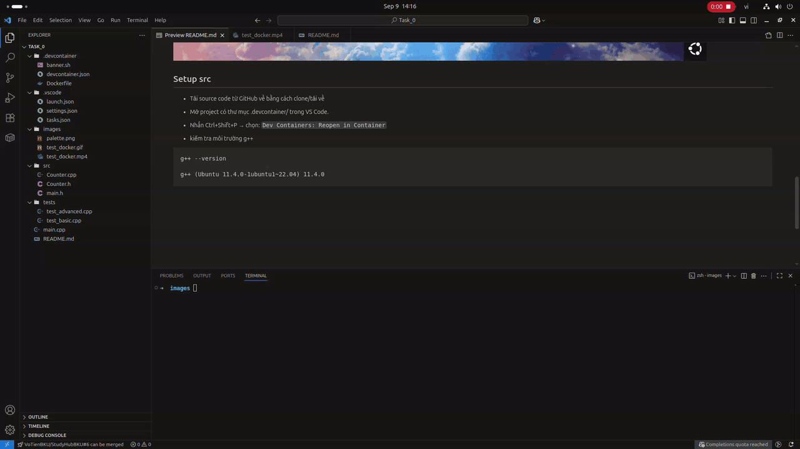

# TASK 1 THIẾT LẬP MÔI TRƯỜNG CHECK MEMORY

## Tải docker

- Cài Docker và WSL trên Windows https://www.youtube.com/watch?v=BlQbLFnvazc&t=829s

- Docker on Mac https://www.youtube.com/watch?v=-EXlfSsP49A

## Test docker

- Nếu muốn chắc chắn Docker đang hoạt động, có thể kiểm tra phiên bản:

```sh
docker --version
docker info
```

- Docker Hello World

```sh
docker run hello-world
```

- liệt kê các container đang chạy

```sh
docker ps -a

CONTAINER ID   IMAGE         COMMAND    CREATED          STATUS                      PORTS   NAMES
c1a2b3d4e5f6   hello-world   "/hello"   2 minutes ago    Exited (0) 2 minutes ago           blissful_fermi
```


## Setup src

- Tải source code từ GitHub về bằng cách clone/tải về

- Mở project có thư mục .devcontainer/ trong VS Code.

- Nhấn Ctrl+Shift+P → chọn: `Dev Containers: Reopen in Container`

- kiểm tra môi trường g++

```sh
g++ --version

root@3f67d7b4d9bd:/workspaces/template# g++ --version
g++ (Ubuntu 11.4.0-1ubuntu1~22.04.2) 11.4.0
Copyright (C) 2021 Free Software Foundation, Inc.
This is free software; see the source for copying conditions.  There is NO
```



---

## THƯ VIỆN doctest
Dự án sử dụng [doctest](https://github.com/doctest/doctest) để viết unit test.  
Đây là một thư viện C++ header-only, cú pháp gần giống `Catch2` nhưng nhẹ hơn và compile nhanh hơn.  

Ví dụ một test đơn giản cho `LinkedList`:
```c++
#include "doctest.h"
#include "src/LinkedList.h"

TEST_CASE("insertHead_002")
{
    Node *head = nullptr;

    insertHead(head, 10); // list: 10
    insertHead(head, 20); // list: 20 -> 10
    insertHead(head, 30); // list: 30 -> 20 -> 10

    REQUIRE(head != nullptr);
    CHECK(head->data == 30);
    REQUIRE(head->next != nullptr);
    CHECK(head->next->data == 20);
    REQUIRE(head->next->next != nullptr);
    CHECK(head->next->next->data == 10);
    CHECK(head->next->next->next == nullptr);
}

```

## Run Test
- Biên dịch :
```sh
g++ -std=c++17 -o main -I. -Isrc main.cpp tests/*.cpp src/LinkedList.cpp 
```

- Chạy toàn bộ test
```sh
./main
```

- Chạy 1 test cụ thể  `TEST_CASE("insertHead_002")`
```sh
./main --test-case="insertHead_002"
```


-  Biên dịch check memory:
```sh
g++ -std=c++17 -fsanitize=address -fno-omit-frame-pointer -g -O0 -Wall -Wextra -I. -Isrc main.cpp tests/*.cpp src/LinkedList.cpp -o main_memory

./main_memory
```


---

## Debug

VSCode + extension **C/C++ (ms-vscode.cpptools)** để debug bằng `cppdbg`

### ⚙️ tasks.json

File `tasks.json` định nghĩa **task build** để biên dịch project thành `main_debug`:

```json
{
    "version": "2.0.0",
    "tasks": [
        {
            "label": "VOTIEN_DSA2_HK251",
            "type": "shell",
            "command": "g++",
            "args": [
                "-std=c++17",
                "-g",
                "-Isrc",
                "-I.",
                "main.cpp",
                "src/LinkedList.cpp",
                "tests/*.cpp",
                "-o",
                "main_debug"
            ],
            "group": {
                "kind": "build",
                "isDefault": true
            },
            "problemMatcher": [
                "$gcc"
            ]
        }
    ]
}
```

### launch.json

File `launch.json` định nghĩa cấu hình để debug bằng `gdb`:

- **Debug All Tests:** chạy toàn bộ test trong project
- **Debug: 1 Cases:** chạy 1 test case cụ thể với tham số --test-case=Basic 
iteration
```json
{
    "version": "0.2.0",
    "configurations": [
        {
            "name": "Debug All Tests",
            "type": "cppdbg",
            "request": "launch",
            "program": "${workspaceFolder}/main_debug",
            "args": [],
            "cwd": "${workspaceFolder}",
            "stopAtEntry": false,
            "MIMode": "gdb",
            "preLaunchTask": "VOTIEN_DSA2_HK251"
        },
        {
            "name": "Debug: 1 Cases",
            "type": "cppdbg",
            "request": "launch",
            "program": "${workspaceFolder}/main_debug",
            "args": [
                "--test-case=countNodes_002"
            ],
            "cwd": "${workspaceFolder}",
            "stopAtEntry": false,
            "MIMode": "gdb",
            "preLaunchTask": "VOTIEN_DSA2_HK251"
        }
    ]
}
```


---
<p align="center">
  <a href="https://www.facebook.com/Shiba.Vo.Tien">
    
  </a>
  <a href="https://www.tiktok.com/@votien_shiba">
    
  </a>
  <a href="https://www.facebook.com/groups/khmt.ktmt.cse.bku?locale=vi_VN">
    
  </a>
  <a href="https://www.facebook.com/CODE.MT.BK">
    
  </a>
  <a href="https://github.com/VoTienBKU">
    
  </a>
</p>
